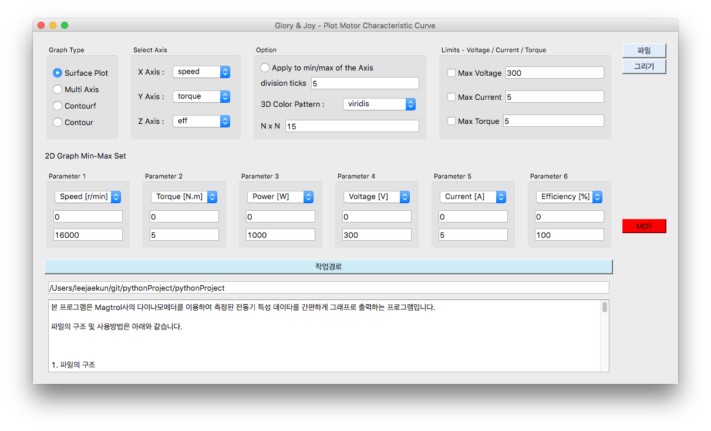
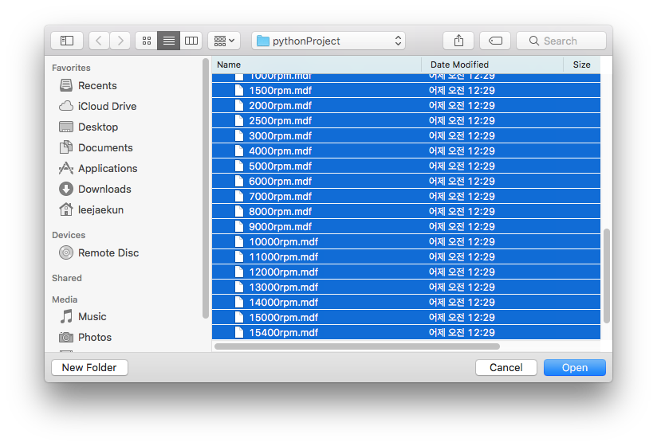
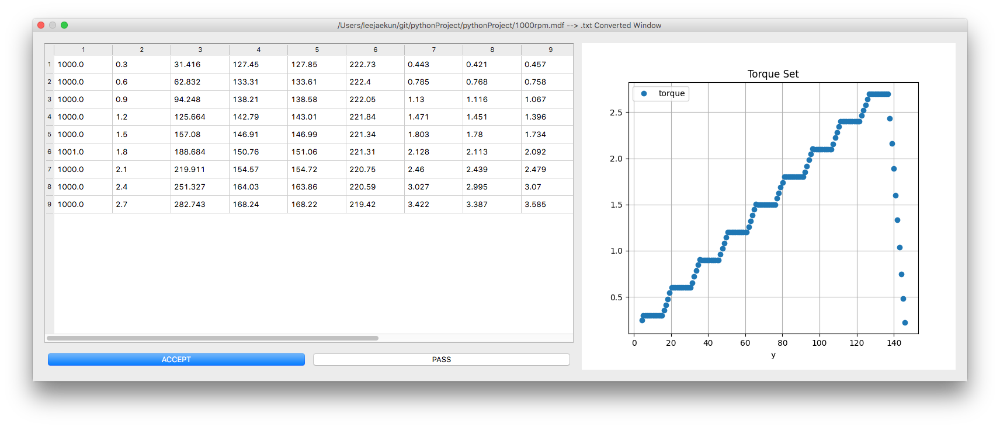
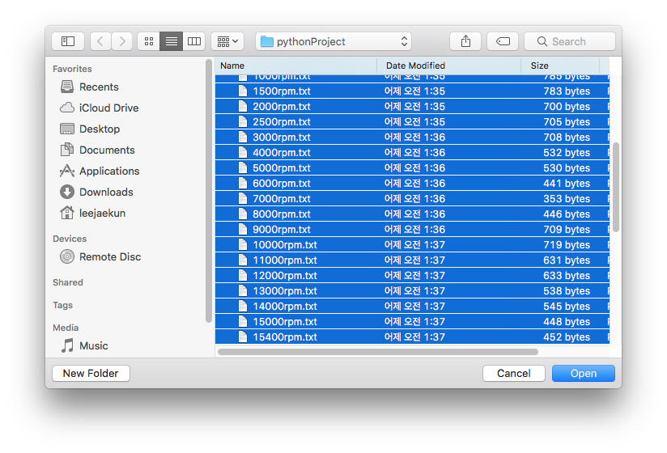
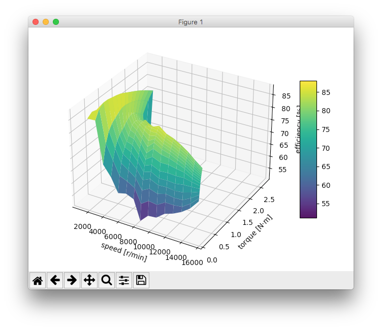
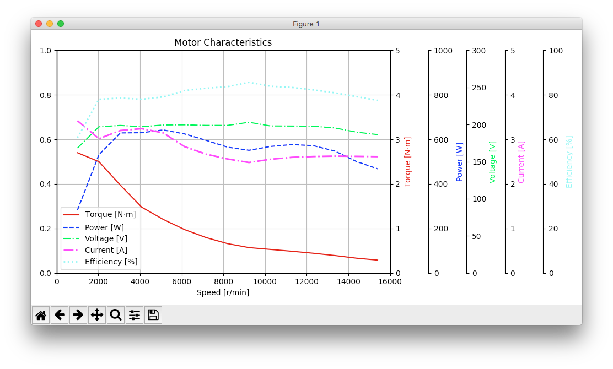
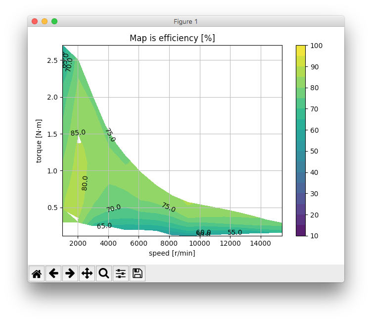

# Project 에 대한 설명
## 목적 
Magtrol사의 다이나모에서 얻는 전동기 측정 데이타를 나름 간단하게 데이타를 정리하고,
그래프 출력을 하루 수 있도록 프로그램 제작.

### jupiter notebook 설치 - mac terminal 
본 문서는 jupiter notebook 으로 제작하였습니다.


```python
pip3 install --upgrade pip

pip3 install jupyter

jupyter notebook
```

### program 의 구성
1. plotMotorChar.py : main 프로그램.  
1. *.mdf : 다이나모에서 얻은 데이타 (3상 3선식 결선. 3V3A)  
1. dynamo/DialogWindow.py  
1. dynamo/plotIO.py  
1. dynamo/__init__.py

### program의 동작
</img><br/>

### click mdf
MDF 파일을 불러오며, 속도별 데이타가 있어야 하며, shift(또는 ctrl)를 이용하여 여러 file을 선택한다. 
</img><br/>

### 데이타 선택
데이타는 다이나모에서 연속적으로 저장이 되므로, 그래프를 그리기 위한 1개의 속도 기준으로, 여러개의 토오크 값을 선택을 한다.
마우스로 그래프의 점들을 선택을 한다.  
(아직은 선택한 데이타의 수정이 되지 않으므로 한번에 한번씩 조심조심 하시길...)
</img><br/>

### txt 파일 불러오기.
mdf 에서 추출한 데이타를 이용하여 만들어진 txt를 불러온다. (실제 정리된 데이타)
</img><br/>

### 그리기 - Surface Plot 
화면 왼쪽의 Graph type - 3D Surface Plot 선택(기본)하고 그리기 클릭.  
</img><br/>


### 그리기 - Multi Axis 
화면 왼쪽의 Graph type - Multi Axis
</img><br/>

### 그리기 - Contourf Plot 
화면 왼쪽의 Graph type - Contourf   
</img><br/>

# usage.txt
본 프로그램은 Magtrol사의 다이나모메터를 이용하여 측정된 전동기 특성 데이타를 간편하게 그래프로 출력하는 프로그램입니다.
파일의 구조 및 사용방법은 아래와 같습니다.

---

## 파일의 구조
### 다이나모에서 설정
1. Time	        : 측정 시간. (sec)   
1. Speed 1 (RPM)   : 회전속도 (r/min)   
1. Torque 1 (N.m)  : 토오크. 단위는 다이나모 셋팅으로 조정. 본 프로그램은 지원 안됨.   
1. Watts OUT 1	    : 전동기 기계적 출력 (W)   
1. Volts 1	        : 전동기 두상간 상간의 전압 (RMS) - 전력분석기 결선과 관련됨 (V)   
1. Volts 2	        : 전동기 두상간 상간의 전압 (RMS) - 전력분석기 결선과 관련됨 (V)   
1. Volts 3	        : 제어기 입력단(AC) 전압  (V)   
1. Amps 1	        : 전동기 1상의 전류 (RMS) - 전력분석기 결선과 관련됨 (A)   
1. Amps 2	        : 전동기 1상의 전류 (RMS) - 전력분석기 결선과 관련됨 (A)   
1. Amps 3	        : 제어기 입력단(AC) 전류 (A)   
1. Watts IN Sum A	: 전동기 3상 입력의 합 (W)   
1. Watts IN Sum B	: 제어기 입력단의 입력 (W)   
1. Efficiency Sum A : 전동기 효율 ( Watts OUT 1 / Watts IN Sum A * 100 )   
1. Efficiency Sum B : 시스템 효율 ( Watts OUT 1 / Watts IN Sum B * 100 )   
1. PF 1           : Power Factor   
* 위의 순서로 데이타가 구성이 되어 있어야 오류가 없음.  
   
### 측정 및 데이타 기록.   
    측정하고자 하는 회전수 대역을 정한다.   
    측정하는 속도 범위가 500 - 600 - 700 - 800 rpm 이라고 하면,   
    500rpm 에서 각 토오크 ( 0.5 - 1.0 - 1.5 Nm) 별로 데이타를 측정한다.   
    토오크는 정상상태를 기준으로 측정을 하며, 속도 및 토오크의 변화를 최소로 하여 측정을 한다.   
    다이나모에서는 결과 파일이 1개릘 mdf 파일로 만들어 지며,   
    사용자는 이 파일을 각 회전수 별, 각 회전수 당 1줄의 데이타를 가지도록 엑셀 등으로 수정을 한다.  
    아래 예를 들어 보았다.   

    [주1] 파일에서는 주석줄은 저장하지 않음  
    600rpm.txt 예제  
    62.866 600 0.05  3.4 137.8 137.14 220.13 0.23 0.112 ...  
    62.967 600 0.50  31.4 141.4 141.34 220.03 0.35 0.298 ...   
    63.097 600 1.00  62.7 144.3 144.20 219.87 0.57 0.537 ...   
    63.199 600 1.50  94.2 147.1 146.98 219.66 0.82 0.789 ...   
    63.307 600 2.00 125.7 150.3 150.12 219.45 1.06 1.041 ...   
       .     .    .       .       .        .       .      .       .     ...  
       .     .    .       .       .        .       .      .       .     ...  
       .     .    .       .       .        .       .      .       .     ...  

  * 파일 개수(속도)는 2 ~ 10 이하로 있어야 하며 8 ~ 9 개 정도를 추천함.   
  * 파일내 줄 개수(또는 토오크 개수)는 5개 이상을 추천함.   
  * 데이타가 많으면 정밀하기는 하지만, 본 프로그램이 보간법을 이용하므로 적당한 수량을 추천함.   
---

## 프로그램 사용법   

### Graph Type   
1. Surface Plot : 측정된 데이타 내에서 특성을 3차원 평면으로 그려준다   
1. Multi Axis : 전동기 최대 운전 특성을 그려준다(Max Voltage, Max Current 설정 ).     
1. Contour 2D : 2차원 평면에 [1]번의 그래프를 그려준다.     
  ** 그래프의 level 값은 아래와 같이 설정을 함     
  * Z Axis 의 값을 효율로 선택 : 10,  15,  20,  ...,  85,  90,  95, 100    
  * Z Axis 의 값을 전압으로 선택 :  10,  20,  30,  ..., 180, 190, 200     
  * 다른 것은 15단계로 표현을 하여줌   

### Select Axis     
X-Y-Z 3개의 축을 원하는 위치에 설정을 할 수 있다.     

### Option    
1. Apply to min/max of the Axis : '2D Graph Min-Max Set' 입력된 값을 축에 적용. 기본값은 선택안함    
1. division ticks : [1]이 설정되고 각 축의 분할 개수를 설정한다. 기본값은 5  
1. 3D Color Pattern : 그래프의 색상을 조절을 함. Graph Type [1], [3]에만 적용됨  
1. N x N : 보간법 진행에 사용될 Array 개수. 항상 n x n 이며 값이 크면 계산시간이 오래 걸림. 기본값은 15  

### Limits - Voltage / Current  
1. Max Voltage : 전동기 최대전압 설정. 전동기 특성과 관계없음. 그래프 출력에 사용됨. 기본값 300  
1. Max Current : 전동기 최대전류 설정. 전동기 특성과 관계없음. 그래프 출력에 사용됨. 기본값 5  
1. Max Torque : 전동기 최대xhdhzm 설정. 전동기 특성과 관계없음. 그래프 출력에 사용됨. 기본값 5  
 * 각 메뉴앞의 check button 은 현재 사용하지 않음.  
 * 설정값이 변경이 되면 데이타 파일을 다시 불러와야 함. 바로 업데이트 되지 않음.  

### 2D Graph Min-Max Set  
1. Parameter 1 : 속도의 최소/최대 설정. 기본값 0 / 2000 . 아래 콤보는 지원하지 않음.  
1. Parameter 2 : 토오크의 최소/최대 설정. 기본값 0 / 5 . 아래 콤보는 지원하지 않음.  
1. Parameter 3 : 출력의 최소/최대 설정. 기본값 0 / 500 . 아래 콤보는 지원하지 않음.  
1. Parameter 4 : 전압의 최소/최대 설정. 기본값 0 / 300 . 아래 콤보는 지원하지 않음.  
1. Parameter 5 : 전류의 최소/최대 설정. 기본값 0 / 5 . 아래 콤보는 지원하지 않음.  
1. Parameter 6 : 효율의 최소/최대 설정. 기본값 0 / 100 . 아래 콤보는 지원하지 않음.  

### 파일 버튼  
 * 파일 버튼을 눌러 Dialoue 창을 열어 "Shift + 첫번째 파일 + 마지막 파일" --> 다중파일을 선택한다  
 * 파일이름이 위의 규칙 '속도+rpm.txt'에 맞지 않는 경우는 경고메세지 발생을 함  
 * Dialoge 창이 열리고 "취소"를 누르면 프로그램이 강제 종료됨. 버그 수정 예정.  

### 그리기  
 * 파일을 한번 불러오면 됨. 다른 데이타를 그리고 싶으면 파일을 눌러 데이타를 새로 불러옴.  
 * 최대/최소 또는 그래프의 형태 등의 값이 변경이 되면, 창을 닫고 그리기를 다시 실행한다.  
 * 화면에 입력되는 모든 값은 '숫자(정수/소수)'만 입력이 되야 함. 문자 입력시 오류 메세지 출력  
---

## Message Browser  
  : 사용법 및 불어들인 파일 이름 등...   디버깅용임. 수정은 불가.  
  : 프로그램 실행중의 메세지 출력함.  
## 작업 경로  
  : 작업을 하는 위치/폴더를 선택합니다.  
  : 프로그램 종료시 최종 작업 위치를 기억합니다.  
  : 오류발생시 설치폴더에 'folderHistory.ini' 파일이 있는지 확인하세요.  
  : 프로그램이 한번 실행을 하면 자동으로 'folderHistory.ini'파일이 생성됩니다.  
## 불러오기 업데이트.  
  : Max 전압, 토오크, m x n 이 변경이 되면 파일을 다시 불러와야 합니다.    
  
---
반갑습니다. 그래프 프로그램을 시작 합니다.  
배포일 : 2022-01-26 
배포자 : (주)지앤제이 / 기술연구소 / 수석연구원 / 이재건 
  
사용중 발생하는 프로그램 오류는 말씀해주세요.  
연락처 : 이재건 (localid@gmail.com / 010-3172-4022)  

---


# pyinstaller 컴파일 


```python
pyinstaller --hidden-import scipy.spatial.transform._rotation_groups --onefile plotMotorChar.py
```


      File "/tmp/ipykernel_81/1780713553.py", line 1
        pyinstaller --hidden-import scipy.spatial.transform._rotation_groups --onefile plotMotorChar.py
                                  ^
    SyntaxError: invalid syntax


scipy 가 있는 경우, 컴파일 에러가 발생을 함.
